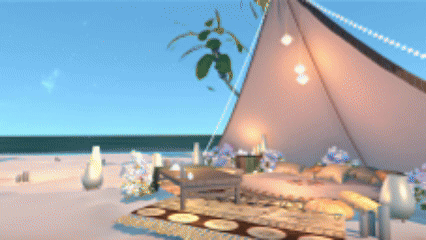
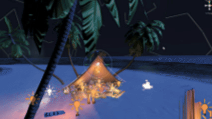
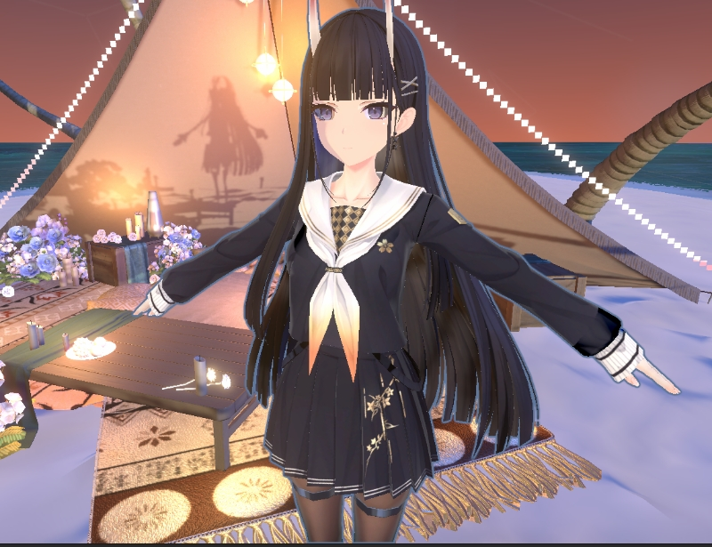

# URP14:天气系统模拟
## 这是什么？
这是我自己对于HLSL学过的一些经验和总结。这个项目中含有大量使用HLSL/ShaderGraph完成的环境特性，并且有开放时间系统允许选择。**本项目使用Universal RenderPipeline14，Unity 2022 3.43构建，部分方法名字可能会有所变化。**
## 含有的特性：
- 使用颜色查找代替的大气散射/昼夜变化的天空盒
- 使用Mixed Light实时渲染和烘培混合的布景
- 使用相机获取的深度模拟的真实海洋/水系统
- 使用RenderFeature参与的光线步进的God Ray和高度雾，高度雾支持使用2D噪声Tex
- 自定义的时间系统，允许调整时间的步长。开放Global接口，允许发生不同的事件（在本项目中进行了Bloom的日出日落变化、太阳月亮的光照和颜色变化、银河星星的出现和消失）。        
想要查阅更加详细的特性，请前往[BiliBili](www.bilibili.com/video/BV1wFo2YSEbT)查阅。
## 效果展示

## 未来还需要更新的：
目前除了Main,还有一个Character分支。这个分支是用于实现来比碧蓝航线能代的角色渲染逆向。逆向Shader，对于部分莫名其妙的特性做了删减。
**目前特性：**
- iLM贴图蒙版支持（高光 漫反射 ao） 
- 渐变Ramp阴影支持 高光Matcap支持
- 丝袜蒙版支持（还有一堆变量） 
- 常规高光Metallic工作流支持  
- 自阴影投射/软阴影/方向阴影指定支持  
- 阴影Offset支持  
- 基于背面剔除的描边  
- 屏幕空间边缘光支持  
- 面部sdf图支持
- 使用forward+管线多灯光照明支持
**删除/精简掉的特性：**
- 视差高光/阴影贴图  
- 多采样matcap  
- 删除部分法线贴图（草台班子.jpg）  
- 精简高光对阴影的影响（直接smoothstep）
- 对于部分重映射直接用乘数因子代替线性映射
**待开发：**
- 使用stencil眼透  
- 动态高光（虽然这两个特性碧蓝航线都没有，难绷）  
- 根据ilm动态切换ramp阴影
- 嘴巴的混合模式似乎有点问题，可能要指定高度切换成变暗的混合模式（现在是直接lerp）
